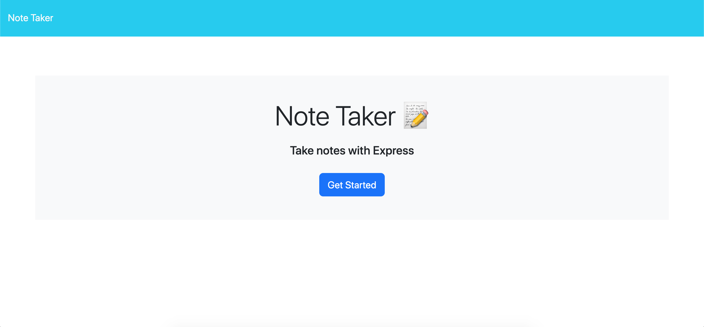

# note-taking-application

This application is built with the purpose of allowing small businesses to easily add notes and collect them in one location.

Using databases to store the notes, this is more robust than a local storage system.

Getting the routes working was quite a struggle but it was good to build on this knowledge.

The deployed code is accessible here: https://github.com/dylanadams98/note-taking-application

The deployed page is accessible here: https://dylanadams98.github.io/note-taking-application

